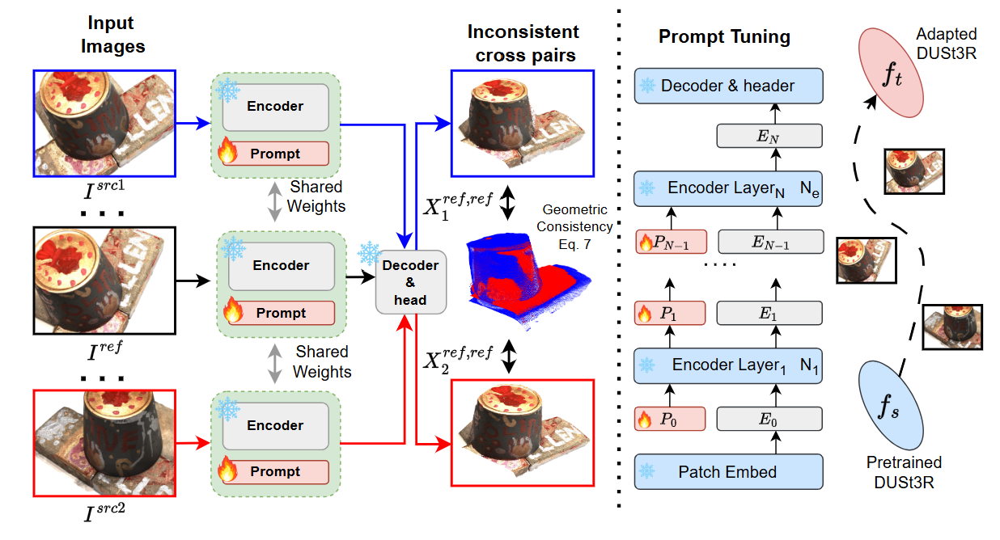

# Test3R: Learning to Reconstruct 3D at Test Time


> **Test3R: Learning to Reconstruct 3D at Test Time**    
> [Yuheng Yuan](https://github.com/nopQAQ), [Qiuhong Shen](https://scholar.google.com/citations?user=HsPH688AAAAJ&hl=en), [Shizun Wang](https://littlepure2333.github.io/home/), [Xingyi Yang](https://adamdad.github.io/), [Xinchao Wang](https://sites.google.com/site/sitexinchaowang/)    
> [xML Lab, National University of Singapore](https://sites.google.com/view/xml-nus/home?authuser=0)    
<div align="center">
  </img>
</div>

## Getting Started

### Installation

1. Clone Test3R.
```bash
git clone --recursive https://github.com/nopQAQ/Test3R.git
cd Test3R
```
2. Create the environment, here we show an example using conda.
```bash
conda create -n test3r python=3.11 cmake=3.14.0
conda activate test3r 
conda install pytorch torchvision pytorch-cuda=12.1 -c pytorch -c nvidia  # use the correct version of cuda for your system
pip install -r requirements.txt
```

3. Optional, compile the cuda kernels for RoPE (as in CroCo v2).
```bash
cd croco/models/curope/
python setup.py build_ext --inplace
cd ../../../
```

## Evaluation

### Datasets

Please follow [Spann3R](https://github.com/HengyiWang/spann3r/blob/main/docs/data_preprocess.md) and [Robustmvd](https://github.com/lmb-freiburg/robustmvd/blob/master/rmvd/data/README.md) to prepare **7scenes**, **Neural-RGBD**, **DTU** and **ETH3D** datasets.

### **Multi-view Reconstruction**

```bash
bash eval/mv_recon/run.sh
```
### ToDo List
- [ ] More functions and demos.
- [ ] Evaluation code on Robustmvd.

- [ ] Implementation on VGGT.


### Related Work

Our code, data preprocessing pipeline, and evaluation scripts are based on several awesome repositories. Welcome to also check out these awesome works, including but not limited to:

- 3D Geometric Foundation Models: [DUSt3R](https://arxiv.org/abs/2312.14132) / [CUT3R](https://github.com/CUT3R/CUT3R) / [MASt3R](https://arxiv.org/abs/2406.09756) / [Spann3R](https://github.com/HengyiWang/spann3r) / [VGGT](https://arxiv.org/abs/2503.11651) 

- Visual Prompt: [VPT](https://arxiv.org/abs/2203.12119) / [SPT](https://arxiv.org/abs/2402.02382)

### BibTeX
```BibTeX

```